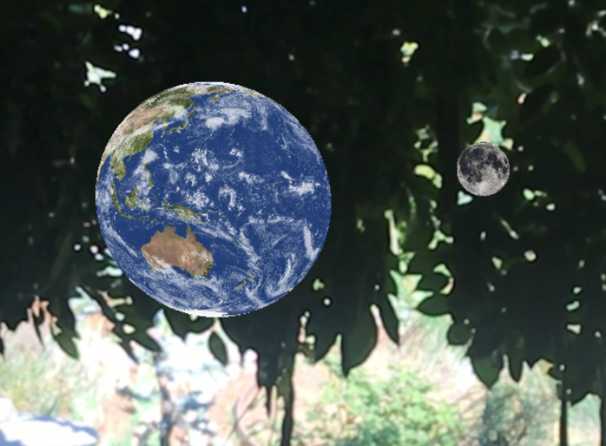

ARKit Earth
============

This sample is a simple ARKit augmented reality demo, based on this [Xamarin ARKit sample](https://developer.xamarin.com/samples/monotouch/ios11/ARKitSample/)

To test this sample you'll need to deploy it on a device running iOS 11 software (the iPhone must be a 6s or newer).

