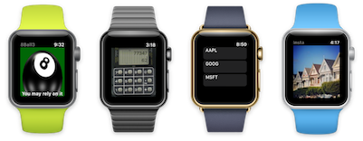
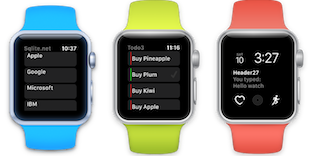

Xamarin iOS & watchOS samples
============================

Apps using Xamarin.iOS, targeting iOS 8 and newer; plus some [watchOS](http://developer.xamarin.com/guides/ios/watch/) demos.

HeartRateMonitor (iOS 8)
----------------
Uses Bluetooth LE APIs to communicate with a heart rate monitor and display the value on the screen. Stores data in iOS 8's Health app via HealthKit.

To9o (iOS 9)
----
Demo iOS 9 features like Force Touch, simpler Collection Views, and localization (including RTL).

TodoToday (iOS 8)
---------
Todo list application with an iOS 8 Today Extension for the notification screen (showing how many items left to-do). Uses ADO.NET for the data access.

Watch8Ball (watchOS 3)
---------
*Your first WatchKit app*

WatchCalc (watchOS 3)
---------
Remember the old Casio...

WatchComplication (watchOS 3)
-----------------
Set face complication text with Scribble!

WatchData (watchOS 3)
---------
Storing and accessing data in Sqlite stored locally with watchOS 3

WatchInsta (watchOS 1)
----------
watchOS 1 demo of accessing files (Instagram photos) on the connected iPhone's filesystem (you have to authenticate on the iPhone first, using OAuth)

WatchTodo (watchOS 1, watchOS 3)
---------
Tiny version of the *Todo* sample that runs on the Apple Watch (works in watchOS 1; in progress for watchOS 3).

