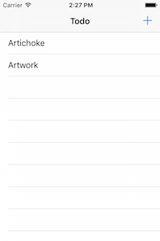
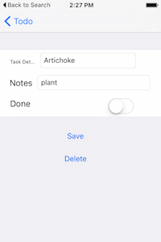
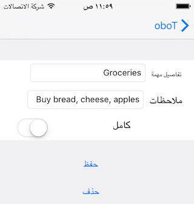
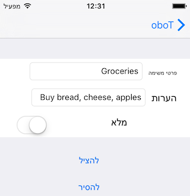
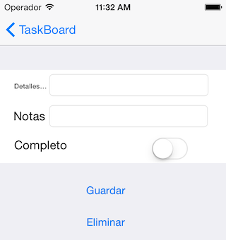

To9o (todo list for iOS 9)
============================

# BETA INCOMPLETE

This project is still under construction - the following are just some
of the tasks still to be done:

* Peek and Push have not been added
* More translations are required
* Properly use size-classes so we can live in mutlitasking panels on iPad


---------------------------

## Search APIs

Implements two [search APIs](https://developer.xamarin.com/guides/ios/platform_features/introduction_to_ios9/search/)

* NSUserActivity
* CoreSpotlight

(although - warning - the code is a bit of a mess right now and needs to be cleaned up)

  


## Updated for iOS 9 RTL support


* in Storyboard, use Auto-Layout `leading` and `trailing` attributess (not `right` and `left`)
* use `TitleText.TextAlignment = UITextAlignment.Natural;` alignment in code, not `Left` or `Right`
* see [Apple's guide](https://developer.apple.com/library/prerelease/ios/documentation/MacOSX/Conceptual/BPInternational/SupportingRight-To-LeftLanguages/SupportingRight-To-LeftLanguages.html#//apple_ref/doc/uid/10000171i-CH17) for other advice eg regarding images.

 


### Spanish and other LTR languages



You can localize all the strings used in a storyboard by creating a `.strings`
file named the same as the storyboard (placed in relevant `.lproj` directory)
and creating strings for each control/property, eg:

**es.lproj/MainStoryboard.strings**

```
"SXg-TT-IwM.placeholder" = "nombre de la tarea";
"Pqa-aa-ury.placeholder"= "otra información de tarea";
"zwR-D9-hM1.text" = "Detalles de la tarea";
"bAM-2j-Rzw.text" = "Notas";
"NF3-h8-xmR.text" = "Completo";
"MWt-Ya-pMf.normalTitle" = "Guardar";
"IGr-pR-05L.normalTitle" = "Eliminar";
```

where the first part of each key is the control's Localization ID in the storyboard,
and the second part is the string property to set (eg a UITextInput's `placeholder`
property, or a UILabel's `text`).

Don't forget these entries in the `Info.plist` (for the languages you wish to support):

```
<key>CFBundleLocalizations</key>
<array>
  <string>de</string>
  <string>es</string>
  <string>ja</string>
</array>
<key>CFBundleDevelopmentRegion</key>
<string>en</string>
```

### WARNING: Using Size Classes (Universal Storyboards)

This sample does *not* use Size Classes, but rather is specifically
targeting iPhone in the storyboard.

If you attempt to localize a Storyboard that uses Size Classes you may
run into [this issue (on StackOverflow)](http://stackoverflow.com/questions/24989208/xcode-6-does-not-localize-interface-builder).
The storyboard elements fail to be localized, and always show the base language.

The easy/hack fix is to duplicate your storyboard strings file into
`MainStoryboard~iphone.strings` and `MainStoryboard~ipad.strings`

(apparently under-the-covers the universal storyboard is duplicated into `~ipad`
and `~iphone` versions; which causes the `.strings` file load to fail because
the filenames don't match exactly)
