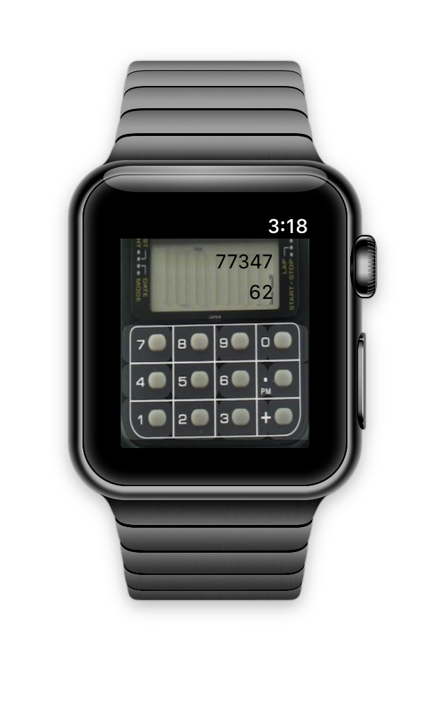

WatchCalc (WatchOS 3)
========

Apple Watch version of an old calculator watch :-) on watchOS 2 everything runs locally! 

## TODO

1. update for 42mm screen
2. pretty up the background

There are also Xamarin [docs for Watch OS](http://developer.xamarin.com/guides/ios/watch/).

*watch screenshots use [Bezel](http://infinitapps.com/bezel/) courtesy of [infinitapps](http://infinitapps.com/)* :)
