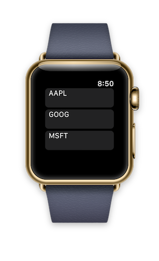

WatchOS 3 Ado.Net
=======================

watchOS 3 version of the [Ado.Net doc](https://developer.xamarin.com/guides/cross-platform/application_fundamentals/data/part_4_using_adonet/) using SQL commands to store and retrieve data on the watch.

Example code that populates the Sqlite database:

```
 Mono.Data.Sqlite.SqliteConnection.CreateFile(dbPath);
 connection = new SqliteConnection("Data Source=" + dbPath);
 var commands = new[] {
 	"CREATE TABLE [Items] (_id ntext, Symbol ntext);",
 	"INSERT INTO [Items] ([_id], [Symbol]) VALUES ('1', 'AAPL')",
 	"INSERT INTO [Items] ([_id], [Symbol]) VALUES ('2', 'GOOG')",
 	"INSERT INTO [Items] ([_id], [Symbol]) VALUES ('3', 'MSFT')"
 };
 // Open the database connection and create table with data
 connection.Open();
 foreach (var command in commands)
 {
 	using (var c = connection.CreateCommand())
 	{
 		c.CommandText = command;
 		var rowcount = c.ExecuteNonQuery();
 		Console.WriteLine("\tExecuted " + command);
 	}
 }
```

Example code reading a set of data:

```
using (var contents = connection.CreateCommand())
{
   contents.CommandText = "SELECT [_id], [Symbol] from [Items]";
   var r = contents.ExecuteReader();
   while (r.Read())
   {
 	  data.Add(new Stock { Id = r["_id"].ToString(), Symbol = r["Symbol"].ToString() });
   }
}
```

Uses `WKInterfaceTable` to display the data:



*watch screenshots use [Bezel](http://infinitapps.com/bezel/) courtesy of [infinitapps](http://infinitapps.com/)* :)
