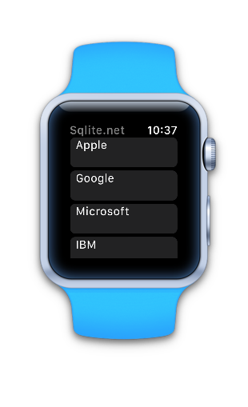

watchOS 3 Sqlite.Net-PCL (in progress)
=======================

watchOS 3 version of the [SQLite.NET PCL doc](https://developer.xamarin.com/guides/cross-platform/application_fundamentals/data/part_3_using_sqlite_orm/) using the SQLite.NET "ORM".

Uses `WKInterfaceTable` to display the data.




Create database and add data:

```
List<Stock> data = new List<Stock>();
// ...
string dbPath = Path.Combine(
	Environment.GetFolderPath(Environment.SpecialFolder.Personal),
	"ormdemo.db3");
var db = new SQLiteConnection(dbPath);
db.CreateTable<Stock>();
if (db.Table<Stock>().Count() == 0)
{
	// only insert the data if it doesn't already exist
	var newStock = new Stock();
	newStock.Id = "1";
	newStock.Name = "Apple";
	db.Insert(newStock);
//...
}
```

Read data and add to list for rendering:

```
var table = db.Table<Stock>();
foreach (var s in table)
{
	Console.WriteLine(s.Id + " " + s.Name);
	// rendered in WKInterfaceTable
	data.Add(s);
}
```