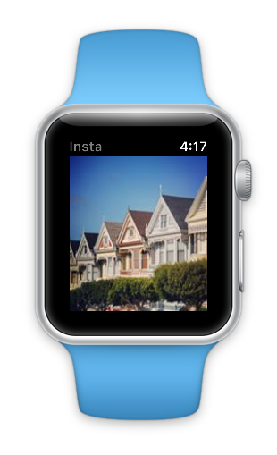

WatchInsta (watchOS 1-style app)
==========

**Requires ClientID and RedirectUrl from [instagram.com/developer](https://www.instagram.com/developer/) added to the `Constants.cs` file.**

A simple Apple Watch Kit demo that:

* Logs into Instagram using OAuth (in the iPhone app), you must do this *before* running the watch app!
* Downloads 5 images from your Instagram feed, and stores them in an App Group container,
* Watch Extension connects to same App Group container to access downloaded instagram images,
* Watch App that gets an image cached on the watch and displays it.

This sample requires the following:

* [Xamarin watchOS Support](http://developer.xamarin.com/guides/ios/watch/).

* [Xamarin.Auth component](http://components.xamarin.com/view/xamarin.auth) for OAuth support.

* [Json.NET](http://www.nuget.org/packages/Newtonsoft.Json/) deserializer for API responses.

* [Instagram Dev API](http://instagram.com/developer/clients/manage/) - you'll need to login and get access for this, and the OAuth details.

Using **App Groups** requires configuration in the [Apple iOS Provisioning site](https://developer.apple.com/account/) 
	to setup an **App ID** and an **App Group** and then configuring the **Entitlements.plist** 
	in Xamarin.Studio:

This is just a demonstration... a fully fledged Instagram integration would no doubt require more
	robust image updating code, and a better first-run experience :)

##UPDATED watchOS 3

Updated to run on latest Instagram API and watchOS 3. Nnote that it is still build as a watchOS 1-style app with the Extension running on the iPhone.

*watch screenshots use [Bezel](http://infinitapps.com/bezel/) courtesy of [infinitapps](http://infinitapps.com/)* :)
