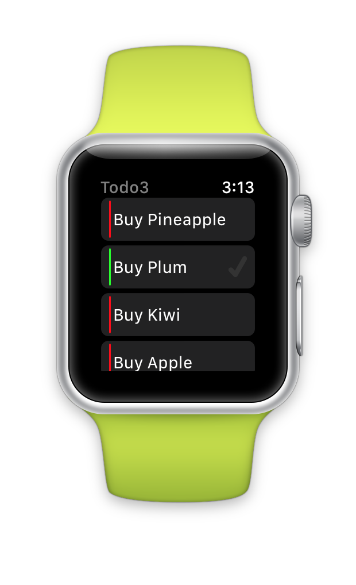

WatchTodo (watchOS 3)
========

Apple watchOS 3 version of [Todo](https://github.com/conceptdev/xamarin-forms-samples/tree/master/Todo).

Uses a hacked-together version of **sqlite-net-pcl** to run on the Apple Watch.

 

There are also Xamarin [docs for watchOS 3](http://developer.xamarin.com/guides/ios/watch/).

*watch screenshots use [Bezel](http://infinitapps.com/bezel/) courtesy of [infinitapps](http://infinitapps.com/)* :)
