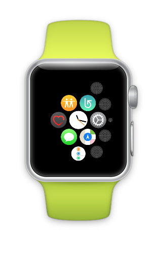
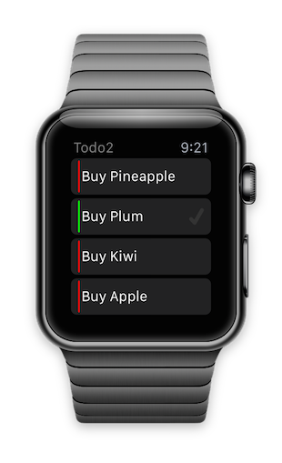

WatchTodo (watchOS 3)
========

Apple watchOS 3 version of [Todo](https://github.com/conceptdev/xamarin-forms-samples/tree/master/Todo).

**WARNING: still a work in progress**

* Uses SQLite.NET PCL nuget... 
* Has some 'hardcoded' data for now (add/save isn't working)

 

There are also Xamarin [docs for Watch Kit](http://developer.xamarin.com/guides/ios/watch/).

*watch screenshots use [Bezel](http://infinitapps.com/bezel/) courtesy of [infinitapps](http://infinitapps.com/)* :)
